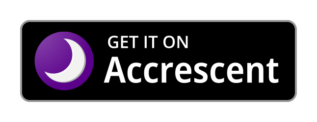

# IronFox

<div align="center">


</div>

<div align="center">

[](https://accrescent.app/app/org.ironfoxoss.ironfox)
[](fdroidrepos://fdroid.ironfoxoss.org/fdroid/repo?fingerprint=C5E291B5A571F9C8CD9A9799C2C94E02EC9703948893F2CA756D67B94204F904)
[](obtainium://app/%7B%22id%22%3A%22org.ironfoxoss.ironfox%22%2C%22url%22%3A%22https%3A%2F%2Fgitlab.com%2Fironfox-oss%2Fironfox%22%2C%22author%22%3A%22IronFox%20OSS%22%2C%22name%22%3A%22IronFox%22%2C%22additionalSettings%22%3A%22%7B%5C%22appIdOrName%5C%22%3A%5C%22org.ironfoxoss.ironfox%5C%22%2C%5C%22versionDetection%5C%22%3Atrue%2C%5C%22releaseDateAsVersion%5C%22%3Afalse%2C%5C%22useVersionCodeAsOSVersion%5C%22%3Afalse%2C%5C%22autoApkFilterByArch%5C%22%3Atrue%2C%5C%22appName%5C%22%3A%5C%22IronFox%5C%22%2C%5C%22about%5C%22%3A%5C%22A%20privacy%20and%20security-oriented%20Firefox-based%20browser%20for%20Android.%5C%22%2C%5C%22appAuthor%5C%22%3A%5C%22IronFox%20OSS%5C%22%7D%22%2C%22overrideSource%22%3A%22GitLab%22%7D)

</div>

**<div align="center">F-Droid QR Code:</div>**

<div align="center">

[](fdroidrepos://fdroid.ironfoxoss.org/fdroid/repo?fingerprint=C5E291B5A571F9C8CD9A9799C2C94E02EC9703948893F2CA756D67B94204F904)

</div>

---

IronFox is a fork of [Divested Computing Group](https://divested.dev/)'s [Mull Browser](https://divestos.org/pages/our_apps#mull), based on [Mozilla Firefox](https://www.mozilla.org/firefox/). **Our goal is to continue the legacy of Mull by providing a free and open source, privacy and security-oriented web browser for daily use.**

> [!IMPORTANT]
>**⚠️ All users are HIGHLY recommended to take a look at our [documentation](./docs/README.md), ESPECIALLY the [Limitations](./docs/Limitations.md) and [Frequently Asked Questions](./docs/FAQ.md) pages!**

> While IronFox's home is [GitLab](https://gitlab.com/ironfox-oss/IronFox), this repo is also mirrored to both [Codeberg](https://codeberg.org/ironfox-oss/IronFox) & [GitHub](https://github.com/ironfox-oss/IronFox).

### Want to join the IronFox Community?

We'd love to see you over on [Matrix](https://matrix.to/#/#ironfox:unredacted.org) _(Recommended)_ and [Discord](https://discord.gg/zbdzfRVyVh)!

## App Installation

Currently, you can install IronFox from [Accrescent](https://accrescent.app/app/org.ironfoxoss.ironfox), from your preferred F-Droid client via our [F-Droid repository](fdroidrepos://fdroid.ironfoxoss.org/fdroid/repo?fingerprint=C5E291B5A571F9C8CD9A9799C2C94E02EC9703948893F2CA756D67B94204F904), with [Obtainium](obtainium://app/%7B%22id%22%3A%22org.ironfoxoss.ironfox%22%2C%22url%22%3A%22https%3A%2F%2Fgitlab.com%2Fironfox-oss%2Fironfox%22%2C%22author%22%3A%22ironfox-oss%22%2C%22name%22%3A%22ironfox%22%2C%22preferredApkIndex%22%3A0%2C%22additionalSettings%22%3A%22%7B%5C%22fallbackToOlderReleases%5C%22%3Atrue%2C%5C%22trackOnly%5C%22%3Afalse%2C%5C%22versionExtractionRegEx%5C%22%3A%5C%22%5C%22%2C%5C%22matchGroupToUse%5C%22%3A%5C%22%5C%22%2C%5C%22versionDetection%5C%22%3Atrue%2C%5C%22releaseDateAsVersion%5C%22%3Afalse%2C%5C%22useVersionCodeAsOSVersion%5C%22%3Afalse%2C%5C%22apkFilterRegEx%5C%22%3A%5C%22%5C%22%2C%5C%22invertAPKFilter%5C%22%3Afalse%2C%5C%22autoApkFilterByArch%5C%22%3Atrue%2C%5C%22appName%5C%22%3A%5C%22IronFox%5C%22%2C%5C%22shizukuPretendToBeGooglePlay%5C%22%3Afalse%2C%5C%22allowInsecure%5C%22%3Afalse%2C%5C%22exemptFromBackgroundUpdates%5C%22%3Afalse%2C%5C%22skipUpdateNotifications%5C%22%3Afalse%2C%5C%22about%5C%22%3A%5C%22A%20privacy%20and%20security-oriented%20Firefox-based%20browser%20for%20Android.%5C%22%2C%5C%22refreshBeforeDownload%5C%22%3Afalse%7D%22%2C%22overrideSource%22%3A%22GitLab%22%7D), or directly from our [GitLab releases](https://gitlab.com/ironfox-oss/IronFox/-/releases).

Regardless of your installation method, we recommend verifying Ironfox's package ID and the checksum of its signing certificate. You can simplify this process using [AppVerifier](https://github.com/soupslurpr/AppVerifier), which also has easy integration with Obtainium. **See [App Verification](#app-verification) below for IronFox's Package ID & SHA-256 of the signing certificate.**

If you are using F-Droid, we recommend [F-Droid Basic](https://f-droid.org/packages/org.fdroid.basic/) as your client of choice. Due to its reduced feature set, F-Droid Basic has less attack surface; meaning it is more secure than the standard client.

It should be noted that our F-Droid repo is hosted using Cloudflare's R2 Storage _(under the EU jurisdiction)_. While not perfect, Cloudflare does have a [strong privacy track record](https://discuss.privacyguides.net/t/quad9-or-cloudflare/15744/9), and due to their high reliabity and performance, we feel this is the best option for most users.

That being said, if you'd rather avoid Cloudflare, we also host a mirror of the F-Droid repo on [Codeberg](https://codeberg.org/ironfox-oss/fdroid), though it comes at the cost of lower reliability & performance. You can add the following link to your F-Droid client:

```sh
https://codeberg.org/ironfox-oss/fdroid/raw/branch/main/fdroid/repo
```

Once added, within the repository's settings on F-Droid, you can disable the other mirrors & leave Codeberg as the only selected option.

We also mirror the F-Droid repo on GitLab [here](https://gitlab.com/ironfox-oss/fdroid). You can add the following link to your F-Droid client if desired:

```sh
https://gitlab.com/ironfox-oss/fdroid/-/raw/main/fdroid/repo
```

## App Verification

**Package ID**: `org.ironfoxoss.ironfox`

**Package ID** *(Nightly)*: `org.ironfoxoss.ironfox.nightly`

**SHA-256 Hash of Signing Certificate**:

```sh
C5:E2:91:B5:A5:71:F9:C8:CD:9A:97:99:C2:C9:4E:02:EC:97:03:94:88:93:F2:CA:75:6D:67:B9:42:04:F9:04
```

## Building

IronFox makes it easier (and faster) to build the project locally.
For example, prebuilt versions of wasi-sdk sysroot and llvm-project are used instead of building them locally. ~~F-Droid builds still build those from source.~~

**It is recommended to use the Docker image for building IronFox.**

### Build with Docker

Pull the docker image with :

```sh
docker pull registry.gitlab.com/ironfox-oss/ironfox:latest
```

You can also use the `main` tag to pull the image which was used to
build the latest IronFox release. Or you can use exact version names
to pull images for those versions.

For example :

```
docker pull registry.gitlab.com/ironfox-oss/ironfox:v135-0
```

Then, you need to [set up the source files](#get--patch-sources).

### Build without Docker

You need to install a few packages on your machine to be able to build IronFox.
Follow the below instructions based on the OS you're using.

<details>
<summary>When building on Ubuntu</summary>

```sh
sudo apt update
sudo apt install -y make \
        cmake \
        clang-18 \
        gyp \
        nasm \
        ninja-build \
        patch \
        perl \
        tar \
        unzip \
        wget \
        xz-utils \
        yq \
        zlib1g-dev
```

Apart from the above packages, you need to install Python 3.9. You can use [PPA from the `deadsnakes` team](https://launchpad.net/%7Edeadsnakes/+archive/ubuntu/ppa).

You will also need to install JDK 8 **AND** JDK 17, with JDK 17 set as the default JDK.

</details>

<details>
<summary>When building on Fedora 42/43</summary>

```sh
sudo dnf install -y \
    cmake \
    clang \
    gawk \
    git \
    gyp \
    m4 \
    make \
    nasm \
    ninja-build \
    patch \
    perl \
    python3.9 \
    shasum \
    wget \
    xz \
    yq \
    zlib-devel
```

You will also need to install JDK 8 **AND** JDK 17, with JDK 17 set as the default JDK. These can be installed from [The Adoptium Working Group's repository](https://adoptium.net/installation/linux/#_centosrhelfedora_instructions).

To add The Adoptium Working Group's repository, you'll want to install Fedora's `adoptium-temurin-java-repository` package and enable the repository:

```sh
sudo dnf install -y adoptium-temurin-java-repository
sudo dnf config-manager setopt adoptium-temurin-java-repository.enabled=1
sudo dnf makecache
```

Now, to install JDK 8 and 17:

```sh
sudo dnf install -y temurin-8-jdk temurin-17-jdk
```

</details>
<summary>When building on macOS</summary>

**NOTE**: [Homebrew](https://brew.sh/) is recommended for installation/management of dependencies on macOS.

```sh
/usr/bin/xcode-select --install
brew install \
    cmake \
    gawk \
    git \
    gnu-sed \
    gnu-tar \
    m4 \
    make \
    nasm \
    ninja \
    node \
    perl \
    python@3.9 \
    temurin@17 \
    wget \
    xz \
    yq \
    zlib
```

</details>

Once the packages have been installed successfully, follow the instructions below to set up the build environment.

### Get & patch sources

Next, you need to download the source files to build. The `scripts/get_sources.sh` file can be used to download/clone the source files.

_This may take some time depending on your network speed..._

```sh
./scripts/get_sources.sh
```

If you need to fetch sources for a different version of Firefox than the one IronFox is currently based on, you'll have to modify the script directly.

Next, you need to patch the files with:

_This must be run once after getting your sources._

```sh
./scripts/prebuild.sh <build-variant>
```

Where `<build-variant>` specifies the variant to build, and is **one** of the following:

- `arm` - 32-bit ARM (`armeabi-v7a`)
- `arm64` - 64-bit ARM (`arm64-v8a`)
- `x86_64` - 64-bit x86
- `bundle` - Android App Bundle (AAB) with all supported ABIs.

> [!IMPORTANT]
> If you want to build the `bundle` variant locally, you need to build the ABI-specific
> variants first, get the generated AAR file for GeckoView and then configure
> `MOZ_ANDROID_FAT_AAR*` environment variables with the path to the generate AAR files.
>
> See [task kinds](https://firefox-source-docs.mozilla.org/taskcluster/kinds.html#build-fat-aar) and [ci-build.sh](./scripts/ci-build.sh) for more details.

### Build

Finally, you can start the build process with:

```sh
./scripts/build.sh apk
```

## Translation

IronFox is translated using Weblate. Visit the [Weblate project](https://hosted.weblate.org/engage/ironfox/) to help with translations.

## Licensing

The scripts are licensed under the [GNU Affero General Public License, version 3 or later](COPYING).

Changes to patches are licensed according to the header in the files this patch adds or modifies ([Apache 2.0](https://www.apache.org/licenses/LICENSE-2.0) or [MPL 2.0](https://www.mozilla.org/MPL/)).

[Phoenix](https://phoenix.celenity.dev/) is licensed under the [GNU General Public License v3.0 or later](https://spdx.org/licenses/GPL-3.0-or-later.html) _(`GPL-3.0-or-later`)_ where applicable. See [`COPYING`](https://phoenix.celenity.dev/COPYING.txt).

`a-c-liberate.patch`, `a-c-localize-maven.patch`, `a-s-localize-maven.patch`, `fenix-liberate.patch`, `gecko-localize-maven.patch`, and `microg-unbreak-fido.patch` are adapted from [Fennec F-Droid](https://gitlab.com/relan/fennecbuild). See [`COPYING`](https://gitlab.com/relan/fennecbuild/-/blob/master/COPYING).

`gecko-rs-blocker.patch` and `gecko-custom-ublock-origin-assets.patch`, are adapted from [LibreWolf](https://librewolf.net/). See [LibreWolf License and Disclaimers](https://librewolf.net/license-disclaimers/).

`fenix-disable-network-connectivity-monitoring.patch`, `gecko-disable-network-id.patch`, `geckoview-ironfox-settings-support-spoof-english.patch`, and `glean-noop.patch` are adapted from the [Tor Project](https://www.torproject.org/). See [`LICENSE`](https://gitlab.torproject.org/tpo/core/tor/-/raw/HEAD/LICENSE).

Our current set of default wallpapers are taken from [Fennec F-Droid](https://gitlab.com/relan/fennecmedia), and are available under the [Unsplash license](https://gitlab.com/relan/fennecmedia#licenses).

## Notices

Mozilla Firefox is a trademark of The Mozilla Foundation.

This is not an officially supported Mozilla product. IronFox is in no way affiliated with Mozilla.

IronFox is not sponsored or endorsed by Mozilla.

IronFox is not associated with DivestOS, Divested Computing Group, or Mull in any manner.

Firefox source code is available at [https://github.com/mozilla-firefox/firefox](https://github.com/mozilla-firefox/firefox).
