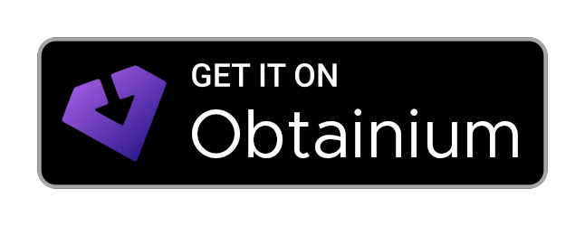

# IronFox

<div align="center">


</div>

<div align="center">

[](https://accrescent.app/app/org.ironfoxoss.ironfox)
[](fdroidrepos://fdroid.ironfoxoss.org/fdroid/repo?fingerprint=C5E291B5A571F9C8CD9A9799C2C94E02EC9703948893F2CA756D67B94204F904)
[](obtainium://app/%7B%22id%22%3A%22org.ironfoxoss.ironfox%22%2C%22url%22%3A%22https%3A%2F%2Fgitlab.com%2Fironfox-oss%2Fironfox%22%2C%22author%22%3A%22IronFox%20OSS%22%2C%22name%22%3A%22IronFox%22%2C%22additionalSettings%22%3A%22%7B%5C%22appIdOrName%5C%22%3A%5C%22org.ironfoxoss.ironfox%5C%22%2C%5C%22versionDetection%5C%22%3Atrue%2C%5C%22releaseDateAsVersion%5C%22%3Afalse%2C%5C%22useVersionCodeAsOSVersion%5C%22%3Afalse%2C%5C%22autoApkFilterByArch%5C%22%3Atrue%2C%5C%22appName%5C%22%3A%5C%22IronFox%5C%22%2C%5C%22about%5C%22%3A%5C%22A%20privacy%20and%20security-oriented%20Firefox-based%20browser%20for%20Android.%5C%22%2C%5C%22appAuthor%5C%22%3A%5C%22IronFox%20OSS%5C%22%7D%22%2C%22overrideSource%22%3A%22GitLab%22%7D)

</div>

**<div align="center">F-Droid QR Code:</div>**

<div align="center">

[](fdroidrepos://fdroid.ironfoxoss.org/fdroid/repo?fingerprint=C5E291B5A571F9C8CD9A9799C2C94E02EC9703948893F2CA756D67B94204F904)

</div>

---

IronFox is a fork of [Divested Computing Group](https://divested.dev/)'s [Mull Browser](https://web.archive.org/web/20250113132510/https://divestos.org/pages/our_apps#mull), based on [Mozilla Firefox](https://www.firefox.com/). **Our goal is to continue the legacy of Mull by providing a free and open source, privacy and security-oriented web browser for daily use.**

> [!IMPORTANT]
>**⚠️ All users are HIGHLY recommended to take a look at our [documentation](https://ironfoxoss.org/docs/), ESPECIALLY the [Limitations](https://ironfoxoss.org/docs/limitations/) and [Frequently Asked Questions](https://ironfoxoss.org/docs/faq/) pages!**

> While IronFox's home is [GitLab](https://gitlab.com/ironfox-oss/IronFox), this repo is also mirrored to both [Codeberg](https://codeberg.org/ironfox-oss/IronFox) and [GitHub](https://github.com/ironfox-oss/IronFox).

### Want to join the IronFox Community?

We'd love to see you over on [Matrix](https://matrix.to/#/#ironfox:unredacted.org) _(Recommended)_ and [Discord](https://discord.gg/zbdzfRVyVh)!

## App Installation

For details and step-by-step instructions on how to install IronFox, see our [Installation](https://ironfoxoss.org/docs/installation/) page.

## App Verification

**Package ID**: `org.ironfoxoss.ironfox`

**Package ID** *(Nightly)*: `org.ironfoxoss.ironfox.nightly`

**SHA-256 Hash of Signing Certificate**:

```sh
C5:E2:91:B5:A5:71:F9:C8:CD:9A:97:99:C2:C9:4E:02:EC:97:03:94:88:93:F2:CA:75:6D:67:B9:42:04:F9:04
```

## Building

IronFox makes it easier (and faster) to build the project locally.
For example, prebuilt versions of wasi-sdk sysroot and llvm-project are used instead of building them locally. ~~F-Droid builds still build those from source.~~

**It is recommended to use the Docker image for building IronFox.**

### Build with Docker

Pull the docker image with :

```sh
docker pull registry.gitlab.com/ironfox-oss/ironfox:latest
```

You can also use the `main` tag to pull the image which was used to
build the latest IronFox release. Or you can use exact version names
to pull images for those versions.

For example:

```
docker pull registry.gitlab.com/ironfox-oss/ironfox:v135-0
```

Then, you need to [set up the source files](#get--patch-sources).

### Build without Docker

**NOTE**: Currently, builds on the latest versions of **`Fedora`**, **`macOS`**, **`secureblue`**, and **`Ubuntu`** systems are supported. YMMV for other operating systems/environments.

**NOTE**: **`macOS`** users must install [Homebrew](https://brew.sh/) *(if is not already installed)* before following the steps below.

First, if you haven't already installed it, you'll want to install `git` for your platform of choice:

**`Fedora`**:

```sh
sudo dnf install git
```

**`macOS`**:

```sh
brew install git
```

**`secureblue`**:

`git` is already installed on secureblue by default, so nothing to do here.

**`Ubuntu`**:

```sh
sudo apt install git
```

After you've successfully installed `git`, the first thing you'll need to do is clone IronFox's source repository:

*(`--depth=1` is specified below to reduce the size of the cloned repository, it can be removed if preferred)*

```sh
git clone --depth=1 git@gitlab.com:ironfox-oss/IronFox.git IronFox
```

You should now navigate to the root of IronFox's source directory, and run the `bootstrap` script:

*(The `bootstrap` script will set-up and install dependencies required to build IronFox on your system)*

```sh
cd IronFox
./scripts/bootstrap.sh
```

#### Get sources

Still from the root of IronFox's source directory, you should now run the `get_sources` script to download the external sources required for building IronFox:

**NOTE**: If you need to fetch sources for a different version of a dependency than the version IronFox is currently using, you'll need to modify `scripts/versions.sh` **BEFORE** running the `get_sources` script.

_This may take some time depending on your network speed..._

```sh
./scripts/get_sources.sh
```

#### Preparing sources

You now need to patch/prepare your newly downloaded sources with the `prebuild` script:

_This must be run once after getting your sources._

```sh
./scripts/prebuild.sh
```

#### Build

Finally, you can start the build process with:

```sh
./scripts/build.sh <build-variant>
```

Where `<build-variant>` specifies the variant to build, and is **one** of the following:

- `arm` - 32-bit ARM (`armeabi-v7a`)
- `arm64` - 64-bit ARM (`arm64-v8a`)
- `x86_64` - 64-bit x86
- `bundle` - Android App Bundle (AAB) with all supported ABIs

In addition to the `AAB`, the `bundle` target also produces APKs for each architecture *(`arm`, `arm64`, and `x86_64`)*, as well as a universal APK containing all architectures.

## Translation

IronFox is translated using Weblate. Visit the [Weblate project](https://hosted.weblate.org/engage/ironfox/) to help with translations.

## Licensing

The scripts are licensed under the [GNU Affero General Public License, version 3 or later](COPYING).

Changes to patches are licensed according to the header in the files this patch adds or modifies ([Apache 2.0](https://www.apache.org/licenses/LICENSE-2.0) or [MPL 2.0](https://www.mozilla.org/MPL/)).

[Phoenix](https://phoenix.celenity.dev/) is licensed under the [GNU General Public License v3.0 or later](https://spdx.org/licenses/GPL-3.0-or-later.html) _(`GPL-3.0-or-later`)_ where applicable. See [`COPYING`](https://phoenix.celenity.dev/COPYING.txt).

`a-c-liberate.patch`, `a-s-localize-maven.patch`, and `fenix-liberate.patch` are adapted from [Fennec F-Droid](https://gitlab.com/relan/fennecbuild). See [`COPYING`](https://gitlab.com/relan/fennecbuild/-/blob/master/COPYING).

`gecko-configure-ublock-origin.patch`, `gecko-prevent-exposing-name-and-vendor-to-extensions.patch`, and `gecko-rs-blocker.patch` are adapted from [LibreWolf](https://librewolf.net/). See [LibreWolf License and Disclaimers](https://librewolf.net/license-disclaimers/).

`fenix-disable-network-connectivity-monitoring.patch`, `gecko-disable-network-id.patch`, `geckoview-ironfox-settings-support-spoof-english.patch`, and `glean-noop.patch` are adapted from the [Tor Project](https://www.torproject.org/). See [`LICENSE`](https://gitlab.torproject.org/tpo/core/tor/-/raw/HEAD/LICENSE).

Our current set of default wallpapers are taken from [Fennec F-Droid](https://gitlab.com/relan/fennecmedia), and are available under the [Unsplash license](https://gitlab.com/relan/fennecmedia#licenses).

## Notices

Mozilla Firefox is a trademark of The Mozilla Foundation.

This is not an officially supported Mozilla product. IronFox is in no way affiliated with Mozilla.

IronFox is not sponsored or endorsed by Mozilla.

IronFox is not associated with DivestOS, Divested Computing Group, or Mull in any manner.

Firefox source code is available at [https://github.com/mozilla-firefox/firefox](https://github.com/mozilla-firefox/firefox).
